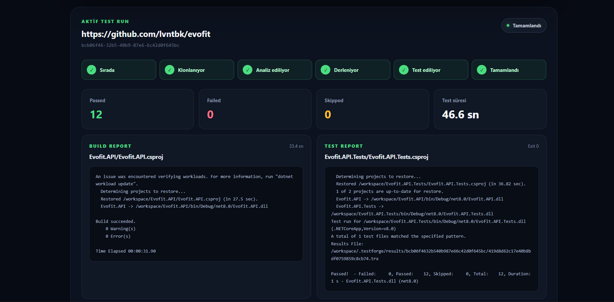
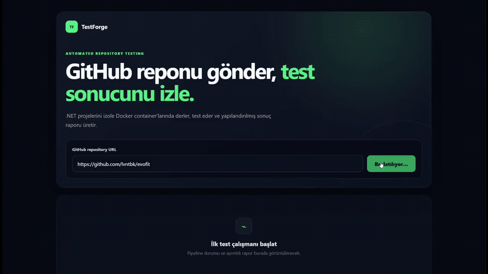
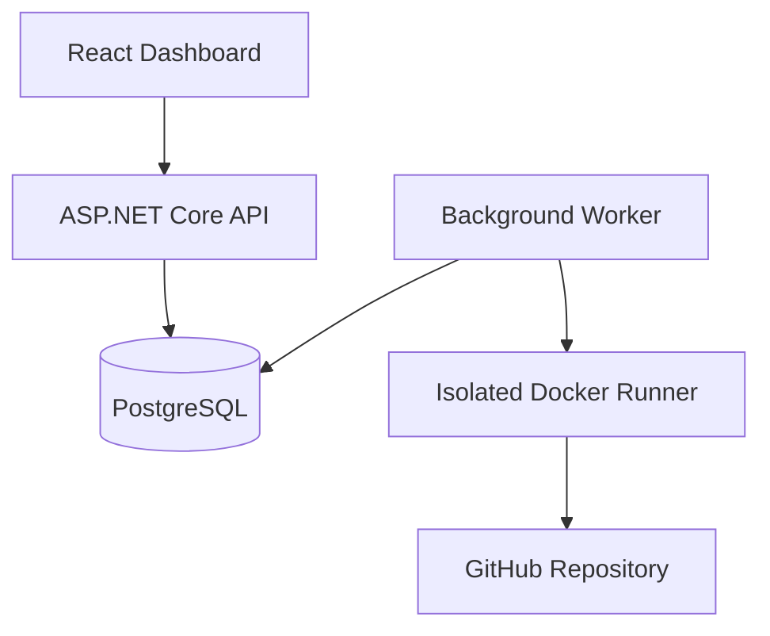

# TestForge

[](https://github.com/lvntbk/TestForge/actions/workflows/ci.yml)


TestForge is an automated testing platform for public .NET GitHub repositories. It clones a repository, detects ASP.NET Core and test projects, builds and tests them inside resource-limited Docker containers, parses TRX results, and presents a structured report through a React dashboard.

## Dashboard



## Highlights

- REST API and responsive React dashboard
- Persistent pipeline: `Queued -> Cloning -> Analyzing -> Building -> Testing -> Completed / Failed`
- ASP.NET Core and .NET test project discovery
- Resource-limited Docker build and test execution
- Build and test timeouts
- Secure TRX/XML parsing
- Passed, failed, and skipped count aggregation
- Persistent PostgreSQL reports and logs
- Automatic frontend polling
- Unit and integration tests

## Demo

[](https://raw.githubusercontent.com/lvntbk/TestForge/main/docs/testforge-demo.mp4)

[Open the full-quality MP4 demo](https://raw.githubusercontent.com/lvntbk/TestForge/main/docs/testforge-demo.mp4)

## Architecture



| Project | Responsibility |
| --- | --- |
| `TestForge.Domain` | State transitions and report entities |
| `TestForge.Application` | Interfaces and application contracts |
| `TestForge.Infrastructure` | PostgreSQL, Git, Docker, analysis, TRX parsing |
| `TestForge.Api` | Test run and report endpoints |
| `TestForge.Worker` | Background pipeline orchestration |
| `TestForge.Tests` | Domain, parser, and API integration tests |
| `frontend` | React and TypeScript dashboard |

## Pipeline

1. Validate the GitHub URL and create a queued run.
2. Shallow-clone and analyze the repository.
3. Build the web project in a constrained Docker container.
4. Run detected tests in constrained Docker containers.
5. Parse TRX output and persist the structured report.
6. Poll the API and render results in the dashboard.

## Technology

- **Backend:** C#, .NET 8, ASP.NET Core, EF Core, Npgsql
- **Frontend:** React 19, TypeScript, Vite, Oxlint
- **Data:** PostgreSQL 16
- **Execution:** Docker, Git, TRX
- **Testing:** xUnit, ASP.NET Core integration tests
- **CI:** GitHub Actions

## API

| Method | Endpoint | Description |
| --- | --- | --- |
| `POST` | `/api/test-runs` | Queue a public GitHub repository |
| `GET` | `/api/test-runs/{id}` | Read pipeline status and errors |
| `GET` | `/api/test-runs/{id}/report` | Read build and test results |

```bash
curl -X POST http://127.0.0.1:5080/api/test-runs \
  -H "Content-Type: application/json" \
  -d '{"repositoryUrl":"https://github.com/lvntbk/evofit"}'
```

See [docs/sample-report.json](docs/sample-report.json) for a representative report.

## Local Development

Requirements: .NET 8, Node.js 22+, Docker Compose, and Git.

```bash
cp .env.example .env
# Replace CHANGE_ME values in .env.
docker compose up -d postgres

set -a && source .env && set +a
dotnet tool restore
dotnet ef database update \
  --project src/TestForge.Infrastructure \
  --startup-project src/TestForge.Api
```

Start the API, Worker, and dashboard in separate terminals:

```bash
ASPNETCORE_ENVIRONMENT=Development ASPNETCORE_URLS=http://127.0.0.1:5080 \
dotnet run --no-launch-profile --project src/TestForge.Api

set -a && source .env && set +a
DOTNET_ENVIRONMENT=Development \
dotnet run --no-launch-profile --project src/TestForge.Worker

npm --prefix frontend install
npm --prefix frontend run dev -- --host 127.0.0.1
```

Open [http://localhost:5173](http://localhost:5173).

## Verification

```bash
dotnet build TestForge.sln
dotnet test TestForge.sln
npm --prefix frontend run lint
npm --prefix frontend run build
```

## Execution Security

Builds and tests use CPU, memory, PID, timeout, capability, and privilege restrictions. Repository paths are validated and XML external entity resolution is disabled while parsing TRX files.

> [!WARNING]
> TestForge executes third-party code. The current MVP is intended for local development and trusted demonstrations. Public deployment requires stronger tenant isolation, network controls, quotas, abuse prevention, and dedicated execution infrastructure.

## Current Limitations

- Public HTTPS GitHub repositories only
- .NET 8 / ASP.NET Core-oriented execution
- Single Worker without atomic multi-worker claiming
- No authentication, private repository access, or quotas
- No workspace cleanup or report retention yet

## Roadmap

- Test run history and filtering
- Explicit failure when no tests are detected
- Workspace cleanup, retention, and log limits
- Atomic multi-worker job claiming
- Private GitHub repository support
- Coverage and code-quality reporting
- Shareable HTML/PDF reports

See [docs/PROJECT_STATUS.md](docs/PROJECT_STATUS.md) for the engineering checkpoint.

## Author

Developed by [Levent Ince](https://www.linkedin.com/in/levent-ince-091838266/) - Backend and DevOps.
